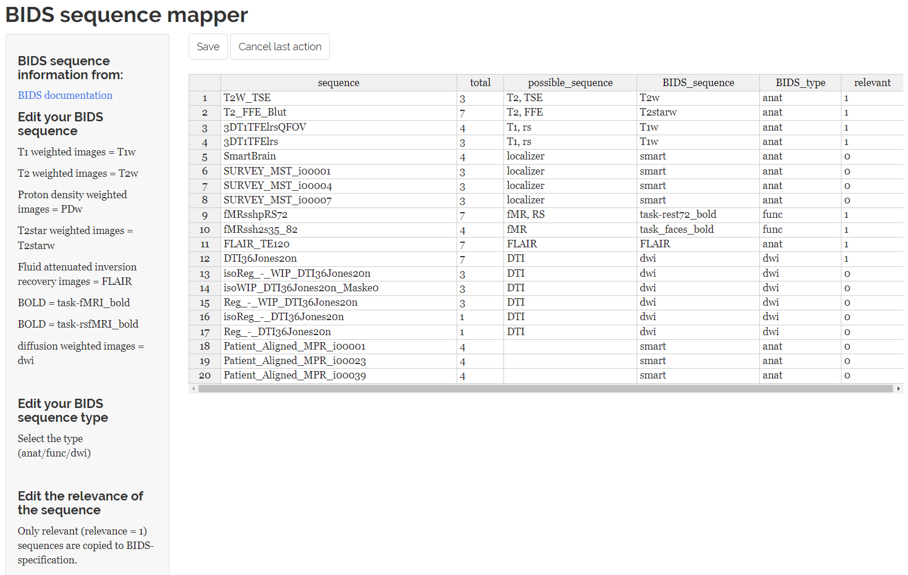
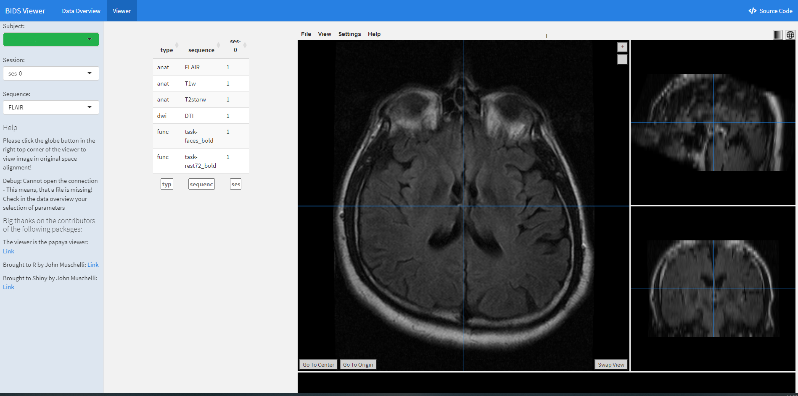

## Start of the workflow 

Based on the inputs your data is converted via dcm2niix into NifTI
format.

All JSON headers are read out and merged together.

The unique sequence-ID’s are extracted and the Sequence Mapper is
launched.

The Sequence Mapper is a Shiny App, which should enable you to rename
your sequences according to the BIDS specification. You can edit a cell
after a double-click on it.

Now the ‘sequence_mapper’ should start showing the following interface:

You have to edit each entry according to the BIDS specification. Some
tips can be found on the left panel and hyperlinks to the BIDS
specification. Then you click “save” and close the ‘sequence mapper’.

1)  You need to edit each cell, that contains a “please edit”.

2)  Each ‘BIDS_sequence’ and ‘BIDS_type’ entry is validated in the
    backend with regular expressions based on BIDS. If a row is coloured
    “green” you have a high chance of a valid BIDS output.

3)  But note, we do not limit you in naming files. You are able to save
    non-valid BIDS strings, which are copied to BIDS, if selected as
    relevant.

4)  You can ignore red rows, when having “irrelevant” marked cells.
    These are not exported to BIDS. Still, you have to remove the
    “please edit” from them. This is mandatory, so that the algorithm
    knows, that the user has edited each cell.

5)  Please “save” your table and close the app. The closing starts the
    rest of the workflow.

The ‘matched’ column shows, when a sequence was detected as BIDS
compliant. If your sequence is in the ‘unmatched’ column investigate
each letter of the filename.

If everything is fine:

1.  The files are copied to BIDS.

2.  The BIDS validation is started. Via Docker, if it is installed on
    your local machine, otherwise the online-version is launched and you
    have to select your folder manually.

3.  You are asked, if you want to delete temporary images from your hard
    drive. Don’t do this manually! Do this only, when you have validated
    your data, and you already acquired all your data.

4.  A Shiny viewer is started to visually inspect the images.

