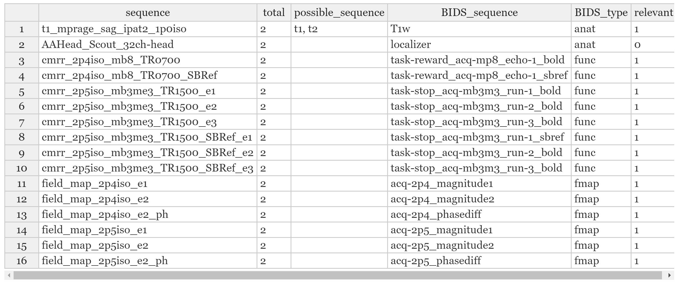

## BIDScoin data tutorial

### The installation procedure: Getting example data and installation of R and RStudio

- Download the BIDScoin example data [bidscoin](https://github.com/Donders-Institute/bidscoin): [Download here](https://surfdrive.surf.nl/files/index.php/s/HTxdUbykBZm2cYM/download). Please note, that the data is compressed twice with gunzip (suffix: '.gz') and tar (suffix: '.tar'). You need to unpack both.
- Create a new folder (e.g. `bidscoin\example`) and copy the `raw` subject folders into it. 
- [Install R](https://cran.r-project.org/mirrors.html) and [RStudio](https://www.rstudio.com/products/rstudio/download/}{https://www.rstudio.com/products/rstudio/download/).
- Follow the [instructions](installation.md) to install Windows or Linux specific dependendies.

### Workflow inside of R: Installation of packages

- Start RStudio and use the R-command line for the next commands.
- Install the R-package devtools by typing `install.packages("devtools")` into the RStudio command line.
- Install the R-package BIDSconvertR from Github `devtools::install_github("wulms/bidsconvertr")`.

### The BIDSconvertR workflow:

- Start RStudio and use the R-command line from here on.
- Execute `library("bidsconvertr")`.
- Start the tool with the `convert_to_BIDS()`command.
- Create your own 'user\_settings.R' file by following the popup messages.
  - Select your input folder containing the DICOM's (e.g. 'bidscoin\_example\raw').
  - Select the "../subject/session/.."" order of folders.
  - Select your output folder.
  - Skip the "subject-ID" and "pattern to remove" functionality. Your subject-ID's are fine!
- Rename your files with the sequence mapper according to BIDS, or download the `sequence_map.tsv` from here and replace the file in your output folder.

- Now the data is automatically saved into BIDS and the 'Shiny BIDS viewer' starts.
